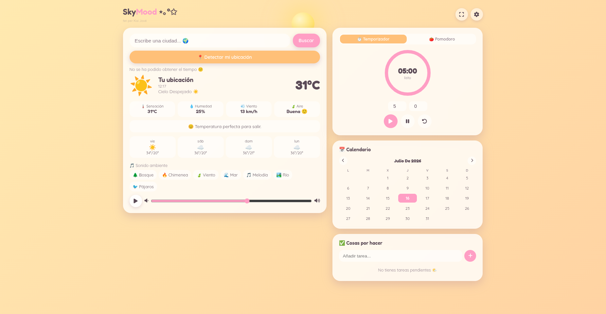
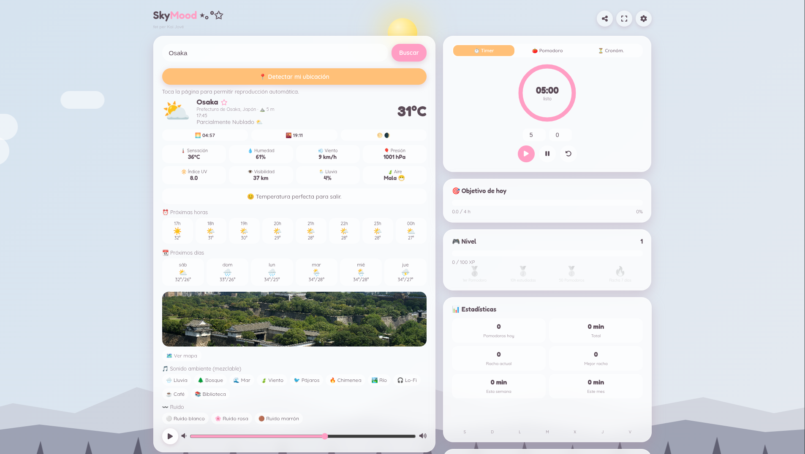

<div align="center">

# 🌤️ SkyMood

### Smart Weather • Ambient • Focus

*A beautiful productivity dashboard that transforms weather into an immersive workspace.*

<p>

**🌐 Live Demo**  
https://cozychan.netlify.app

</p>


</div>

---

# 📸 Preview

<p align="center">


</p>

---

# ✨ About

**SkyMood** is a modern weather and productivity dashboard built to create a calm, immersive workspace.

Instead of simply displaying the weather, SkyMood combines **real-time meteorological data**, **dynamic ambient environments**, **focus tools**, and **personal productivity widgets** into one elegant experience.

Every visit feels different.

The application adapts automatically to:

- 🌤️ Current weather
- 🌅 Time of day
- 🌙 Day & night cycle
- 🌦️ Weather conditions
- 🎨 Dynamic themes
- 🎵 Ambient sounds

The goal is simple:

> **Turn your workspace into a place where you actually enjoy studying and working.**

---

# 🚀 Features

## 🌤️ Smart Weather

- Real-time weather
- Temperature
- Feels like
- Humidity
- Wind speed
- Pressure
- UV Index
- Visibility
- Air Quality
- Rain Probability
- Sunrise & Sunset
- Moon Phase
- Hourly Forecast
- 7-Day Forecast
- Favorite Cities
- Automatic Geolocation

---

## 🎨 Immersive Environment

The entire interface changes depending on the weather and local time.

Features include:

- Animated landscapes
- Dynamic backgrounds
- Mountains
- Moving clouds
- Trees reacting to wind
- Rain effects
- Snow particles
- Lightning
- Fog
- Fireflies
- Shooting stars
- Seasonal themes
- Automatic Day/Night transitions
- Adaptive color palette

---

## 🎵 Ambient Sound Mixer

Create your own perfect study atmosphere.

Available sounds:

- 🌧 Rain
- 🌲 Forest
- 🌊 Ocean
- 🔥 Fireplace
- 🌬 Wind
- 🐦 Birds
- ☕ Coffee Shop
- 📚 Library
- 🏞 River
- 🎵 Lo-Fi
- 🤍 White Noise
- 💗 Pink Noise
- 🤎 Brown Noise

Features:

- Independent volume controls
- Play / Pause
- Sound mixing
- Smooth fade effects

Example:

> 🌧 Rain + 🔥 Fireplace + 🌲 Forest

---

## 🍅 Productivity

Stay focused while you work.

Includes:

- Pomodoro Timer
- Countdown Timer
- Stopwatch
- Daily Goals
- Weekly Goals
- Todo List
- Notes
- Calendar
- Study Sessions
- Focus Mode

---

## 📊 Statistics

Track your progress over time.

- Hours Studied
- Completed Pomodoros
- Current Streak
- Longest Streak
- Weekly Progress
- Monthly Progress
- Productivity Charts
- Goal Completion

Everything is saved locally using **LocalStorage**.

---

## 🏆 Gamification

Learning should feel rewarding.

Unlock:

- XP
- Levels
- Achievements
- Badges
- Daily Challenges
- Study Streaks

---

## 🌍 Explore

Additional widgets include:

- 🗺 Interactive Map
- 📍 Reverse Geolocation
- 📷 City Images
- 🌌 NASA Astronomy Picture of the Day
- 🛰 ISS Live Tracker
- 💬 Daily Motivation
- 🌕 Moon Information

---

# 🛠️ Tech Stack

### Frontend

- HTML5
- CSS3
- JavaScript (ES6+)

### APIs

- Open-Meteo
- BigDataCloud Reverse Geocoding
- OpenStreetMap
- Wikipedia REST API
- REST Countries
- NASA APOD
- WhereTheISS.at

### Technologies

- Fetch API
- LocalStorage
- Web Audio API
- Font Awesome
- Google Fonts
- Progressive Web App (PWA)

---

# 📁 Project Structure

```text
SkyMood
│
├── assets/
│   ├── backgrounds/
│   ├── icons/
│   ├── images/
│   └── sounds/
│
├── css/
├── js/
├── manifest.json
├── service-worker.js
├── index.html
└── README.md
```

---

# 💡 Why I Built This

SkyMood started as a simple weather application.

As the project evolved, it became a complete productivity dashboard designed to combine:

- Beautiful UI
- Weather APIs
- Ambient experiences
- Productivity tools
- Frontend architecture
- Modern animations

The project was built to improve my skills in:

- API Integration
- Asynchronous JavaScript
- DOM Manipulation
- LocalStorage
- Responsive Design
- UI / UX Design
- CSS Animations
- Frontend Architecture

---

# 🚧 Roadmap

## Current Version

- ✅ Real-time Weather
- ✅ Dynamic Themes
- ✅ Ambient Sounds
- ✅ Pomodoro
- ✅ Timer
- ✅ Stopwatch
- ✅ Todo List
- ✅ Calendar
- ✅ Statistics
- ✅ XP & Achievements
- ✅ NASA APOD
- ✅ ISS Tracker
- ✅ Interactive Map
- ✅ PWA Support

### Coming Soon

- Spotify Integration
- AI Assistant
- Cloud Sync
- User Accounts
- Habit Tracker
- Focus Analytics
- Multiplayer Study Rooms
- Smart Recommendations
- Mobile App

---

# 🤝 Contributions

Ideas, suggestions and pull requests are always welcome.

If you have an idea that could improve SkyMood, feel free to open an issue or submit a pull request.

---

# ⭐ Support

If you enjoyed this project, consider giving it a ⭐ on GitHub.

It really helps and motivates future development.

---

<div align="center">

## 🌅 Stay focused. Stay productive. Stay SkyMood.

Built with ❤️ by **Kai Jové**

</div>
